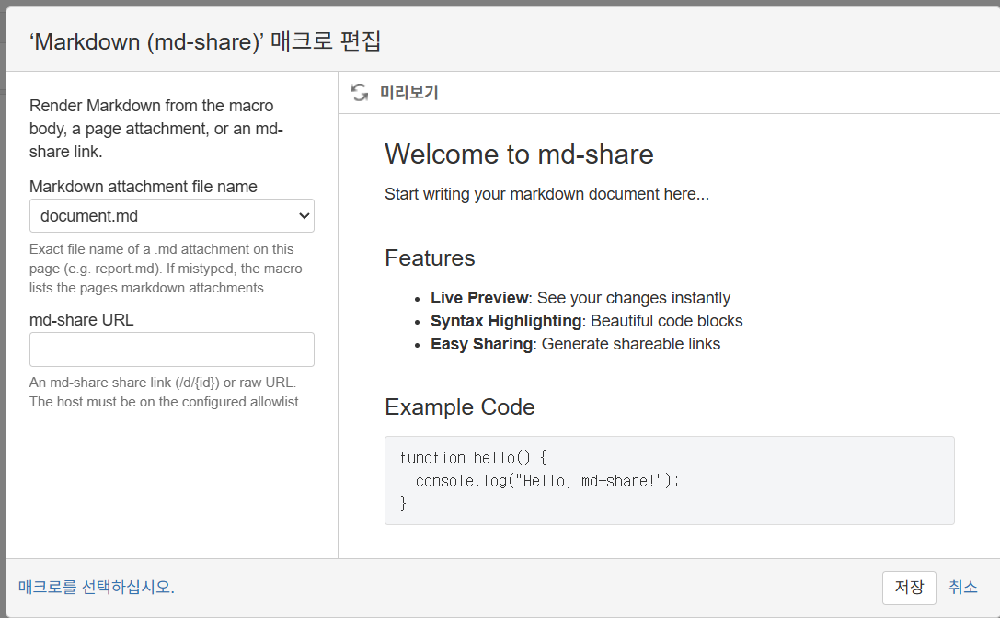
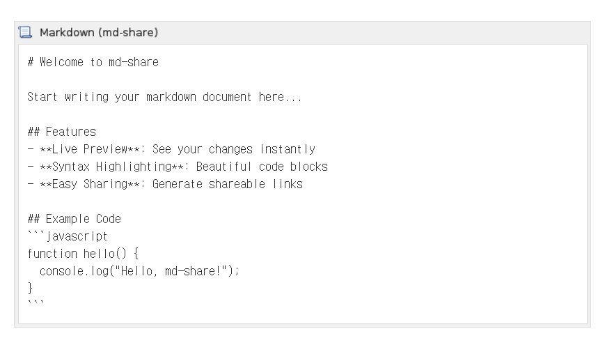
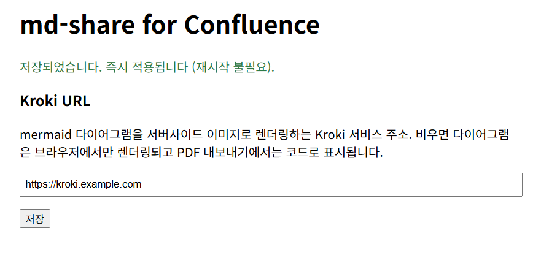

# md-share for Confluence — 사용 가이드 (한국어)

Confluence 페이지에서 Markdown을 렌더링하는 `{md-share}` 매크로 플러그인입니다.
매크로 본문, 페이지 첨부 `.md` 파일, [md-share](https://github.com/junsik/md-share) 공유
링크 세 가지 소스를 지원하며, 웹 화면과 PDF/Word 내보내기 모두에서 표·mermaid
다이어그램이 렌더링됩니다.

## 설치

1. [Releases](https://github.com/junsik/md-share-confluence/releases)에서 최신 jar 다운로드
2. Confluence 관리자 → **Manage add-ons** → **Upload add-on** — 서버 재시작 불필요
3. 편집기를 쓰고 있었다면 하드 리프레시(Ctrl+F5)

## 매크로 사용

편집기에서 `{` 입력 후 `markdown` 타이핑, 또는 매크로 브라우저에서
**"Markdown (md-share)"** 검색(카테고리: 서식/외부 문서).

소스는 우선순위 순서로 하나만 적용됩니다:

| 소스 | 사용법 |
| --- | --- |
| **첨부파일** | 드롭다운에서 이 페이지의 `.md` 첨부를 선택. 파일명을 직접 입력해도 되며, 틀리면 페이지의 md 첨부 목록을 에러 박스로 알려줍니다 |
| **md-share URL** | `/d/{id}` 공유 링크나 raw URL 붙여넣기 — 공유 링크는 자동으로 raw로 변환됩니다. 도메인이 Confluence Whitelist에 등록돼 있어야 합니다 |
| **본문** | 매크로 본문에 Markdown 직접 작성 |

편집기에서는 아래처럼 placeholder로 보이고, 페이지를 저장하면 렌더링됩니다:

## 관리자 설정

### URL 소스 허용 (Whitelist)

관리자 → 보안 → **Whitelist**에 md-share 도메인을 추가합니다
(예: `https://md-share.example.com/*`). Whitelist 기능이 꺼진 인스턴스에서는
시스템 프로퍼티 `mdshare.confluence.allowed-url-prefixes`가 폴백으로 쓰입니다
(둘 다 없으면 URL 소스는 fail-closed로 비활성).

### mermaid 다이어그램 — Kroki 연동

`/plugins/servlet/md-share/admin` (Confluence 관리자 전용)에서 Kroki 서비스
주소를 저장하면 **즉시 반영**됩니다 (재시작 불필요):

- **Kroki 설정 시**: mermaid가 서버사이드 이미지로 렌더링 — 웹은 SVG(선명·확대 가능),
  **PDF/Word 내보내기는 PNG로 포함**됩니다
- **미설정 시**: 브라우저에서만 렌더링되고 PDF에서는 코드 블록으로 남습니다

### TLS 참고

플러그인의 외부 fetch(md-share·Kroki)는 JVM 기본 신뢰에 **Let's Encrypt 루트(ISRG
X1/X2)를 플러그인 범위로 보강**해서 사용합니다 — 구형 번들 JRE에서도 cacerts 수정이나
재시작이 필요 없습니다.

## Markdown 작성 요령

- 문서는 `# 제목` 하나로 시작 (대상·기간 포함 권장)
- GFM만 사용: 표, 체크리스트, 언어 태그 붙은 코드 블록. **raw HTML은 제거됩니다**
- mermaid 크기 요령:
  - 선형 흐름은 `flowchart LR`(가로) — `TD`는 세로로 길어집니다
  - 노드 라벨은 짧게, 수치는 옆의 표로
  - 10노드를 넘으면 자연스러운 경계에서 두 다이어그램으로 분할

AI로 markdown을 생성한다면 [README의 복붙용 프롬프트](../README.md#copy-paste-prompt-for-ai-markdown-generators)를
AI 도구 지침에 넣어 주세요.

## 자주 겪는 문제

| 증상 | 원인/해결 |
| --- | --- |
| "URL is not allowed by the Confluence whitelist" | 관리자 Whitelist에 도메인 추가 |
| "The shared document was not found... expired" | md-share 문서의 TTL 만료 — 영구 보존이 필요하면 `.md`를 페이지 첨부로 올려 attachment 소스 사용 |
| 매크로가 검색에 안 나옴 | 편집기 하드 리프레시(Ctrl+F5) 후 "md" 또는 "markdown"으로 검색 |
| PDF에서 mermaid가 코드로 나옴 | Kroki URL 미설정 — 관리자 설정에서 등록 |
